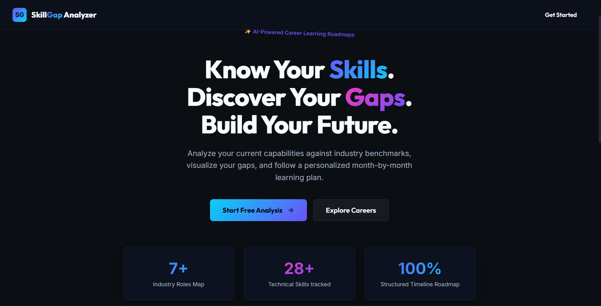
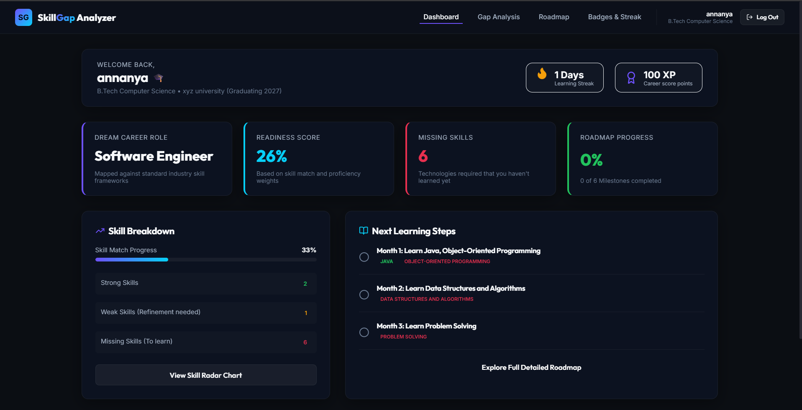
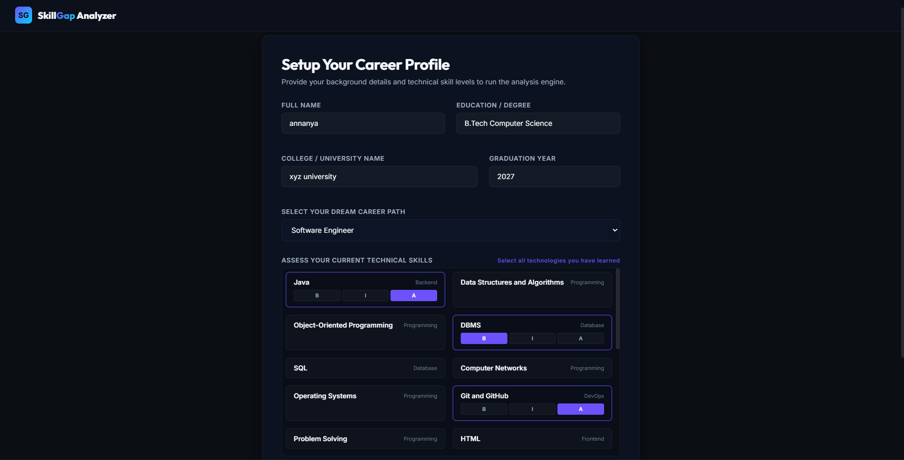
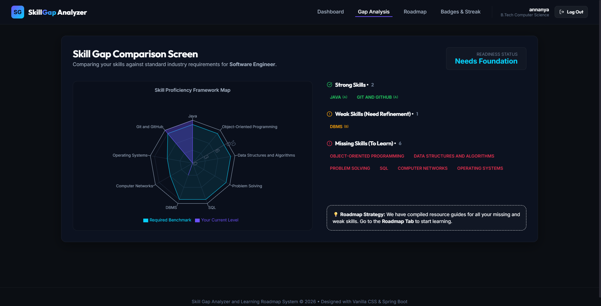
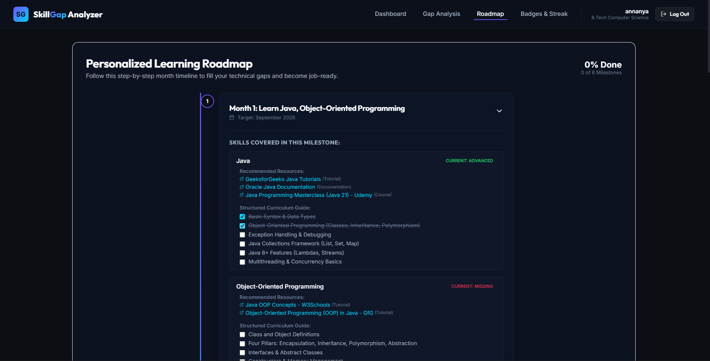
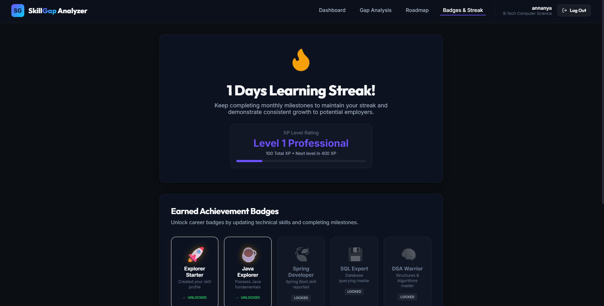

# 🎯 Skill Gap Analyzer

### Personalized Career Skill Analysis & Learning Roadmap System

> Know your skills. Discover your gaps. Build your future.

Skill Gap Analyzer is a full-stack career planning application that helps students assess their technical skills, identify gaps for their target career, and follow a structured 6-month learning roadmap.

The application compares a user's self-assessed skills with predefined career requirements and provides a career readiness score, skill gap analysis, learning resources, and progress tracking through XP, streaks, and achievement badges.
---
## 🎯 Problem Statement

Students preparing for placements often struggle to understand which skills are required for their target career and which of those skills they are currently lacking.

Skill Gap Analyzer addresses this by comparing a user's current technical skills with predefined career requirements and providing:

- An overview of their current skill level
- Strong, weak, and missing skill identification
- A career readiness score
- A structured 6-month learning roadmap
- Learning resources for identified skill gaps
- Progress tracking through milestones and XP
---
## ✨ Key Features

- 👤 **User Profile & Career Selection** — Enter academic details and select a target career.

- 🧠 **Technical Skill Assessment** — Select known technologies and rate proficiency as Beginner, Intermediate, or Advanced.

- 📊 **Skill Gap Analysis** — Identify Strong, Weak, and Missing skills based on career requirements.

- 🎯 **Career Readiness Score** — Calculate an overall readiness percentage based on skill proficiency.

- 📈 **Skill Gap Radar** — Visualize current skills against the required career benchmarks.

- 🗺️ **6-Month Learning Roadmap** — Follow a structured month-by-month learning plan based on the selected career.

- 📚 **Structured Curriculum & Resources** — Access sub-topics and learning resources for recommended technologies.

- 🎮 **XP & Milestones** — Earn XP by completing learning milestones.

- 🔥 **Learning Streaks** — Track consecutive learning progress.

- 🏆 **Achievement Badges** — Unlock badges based on learning progress and completed milestones.
---
## 🖥️ Application Screenshots

### 🏠 Landing Page



### 📊 Dashboard



### 👤 Career Profile & Skill Assessment



### 📈 Skill Gap Analysis



### 🗺️ Personalized Learning Roadmap



### 🏆 Badges & Learning Streak


---
## 🛠️ Tech Stack

### Frontend
- **React**
- **Vite**
- **JavaScript**
- **HTML5**
- **CSS3**
- **Fetch API**

### Backend
- **Java 21**
- **Spring Boot 4.0.6**
- **Spring Web**
- **Spring Data JPA**
- **Hibernate**
- **Maven**

### Database
- **MySQL 8.0**

### Tools
- **Git & GitHub**
- **IntelliJ IDEA**
- **VS Code**
- **DBeaver**
---
## 🏗️ System Architecture

The application uses a simple full-stack architecture:

```text
React + Vite
     │
     │ REST API
     ▼
Spring Boot
     │
     │ Spring Data JPA / Hibernate
     ▼
MySQL 8.0
```

### Application Flow

1. Users interact with the React frontend.
2. The frontend sends requests to the Spring Boot REST API.
3. Spring Boot handles the application logic and database operations.
4. Spring Data JPA and Hibernate manage the interaction with MySQL.
5. The backend returns the required data to the React frontend.
---
## 📊 Skill Gap Analysis

The application compares the user's selected skills and proficiency levels with the predefined requirements for their target career.

### Proficiency Levels

| Level | Score |
|---|---:|
| Beginner | 3 |
| Intermediate | 7 |
| Advanced | 10 |
| Missing | 0 |

Career requirements are defined as:

- **Core Skills** — Advanced-level requirement
- **Optional Skills** — Intermediate-level requirement

### Skill Categories

- **Strong** — Intermediate or Advanced proficiency
- **Weak** — Beginner proficiency
- **Missing** — Required skill not selected

The calculated skill levels are used to generate the career readiness score and the skill gap radar chart.
---
## 🔌 REST API

The React frontend communicates with the Spring Boot backend through REST APIs.

| Method | Endpoint | Description |
|---|---|---|
| `GET` | `/api/roles` | Get available career roles |
| `GET` | `/api/skills` | Get available technical skills |
| `POST` | `/api/users` | Create a user profile |
| `GET` | `/api/analysis/{userId}` | Get the user's skill gap analysis |
| `GET` | `/api/roadmap/{userId}` | Get the user's learning roadmap |
| `PUT` | `/api/roadmap/milestones/{milestoneId}/complete` | Mark a milestone as completed |
---
## 📁 Project Structure

```text
career-planner/
│
├── backend/
│   ├── src/
│   │   ├── main/
│   │   │   ├── java/
│   │   │   └── resources/
│   │   └── test/
│   └── pom.xml
│
├── frontend/
│   ├── src/
│   ├── public/
│   ├── package.json
│   └── vite.config.js
│
├── docs/
│   └── screenshots/
│
├── init_db.sql
├── README.md
└── .gitignore
```
## ⚙️ Getting Started

### Prerequisites

Make sure the following are installed:

- **Java JDK 21+**
- **MySQL 8.0+**
- **Node.js and npm**
- **Git**

### 1. Clone the Repository

```bash
git clone <your-github-repository-url>
cd career-planner
```

### 2. Configure MySQL

Make sure MySQL Server is running on port `3306`.

Open:

`backend/src/main/resources/application.properties`

Update your MySQL credentials:

```properties
spring.datasource.username=root
spring.datasource.password=YOUR_MYSQL_PASSWORD
```

Replace `YOUR_MYSQL_PASSWORD` with your local MySQL password.

The application uses the `career_planner` database. The database is created automatically if it does not already exist, and Hibernate manages the required tables.

### 3. Start the Backend

Open a terminal in the project root:

```bash
cd backend
.\mvnw.cmd spring-boot:run
```

The backend runs on:

`http://localhost:8080`

### 4. Start the Frontend

Open a **second terminal**:

```bash
cd frontend
npm install
npm run dev
```

The frontend runs on:

`http://localhost:5173`
---
## 🚀 Running the Application

Once the backend and frontend are running:

1. Open `http://localhost:5173` in your browser.
2. Create your career profile.
3. Select your target career and assess your skills.
4. View your skill gap analysis and readiness score.
5. Follow the personalized learning roadmap.
6. Complete milestones to earn XP and maintain your learning streak.
---
## 🔮 Future Improvements

- Add user authentication and authorization.
- Expand career roles and skill requirements.
- Improve roadmap personalization based on individual progress.
- Add more learning resources and practice recommendations.
- Add detailed progress analytics and learning statistics.
- Deploy the application for public access.
---
## 👨‍💻 Author

**Annanya Saxena**

B.Tech Computer Science & Engineering

Interested in **Full-Stack Java Development, Spring Boot, React, and Software Engineering**.


---

⭐ If you find this project useful, consider giving it a star on GitHub.